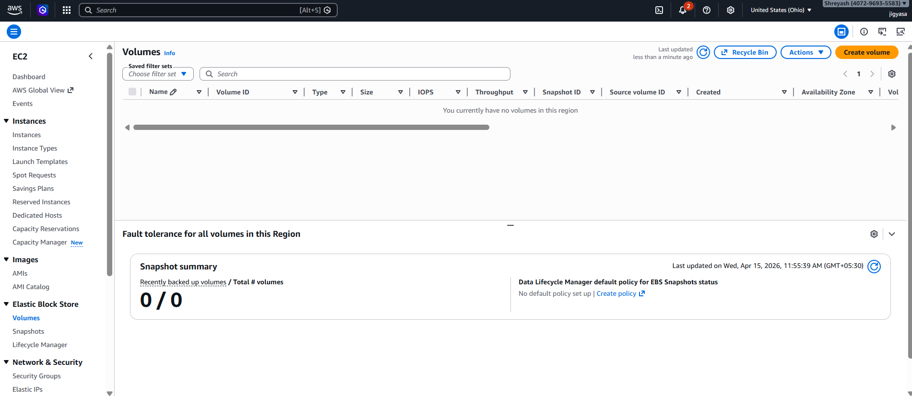
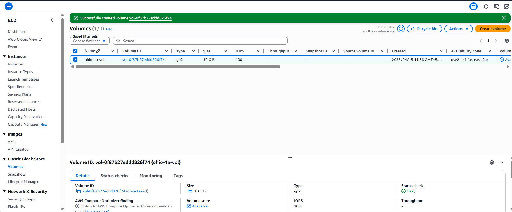
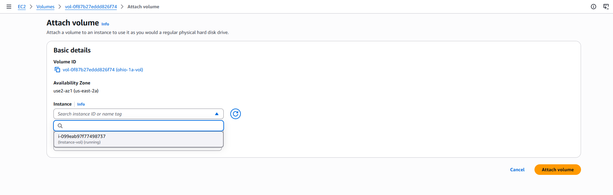
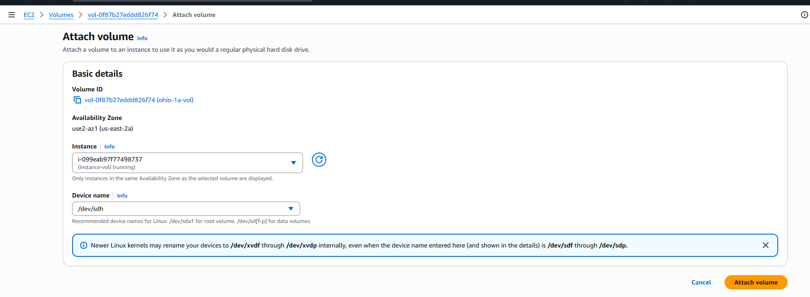
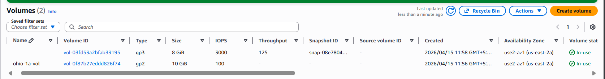
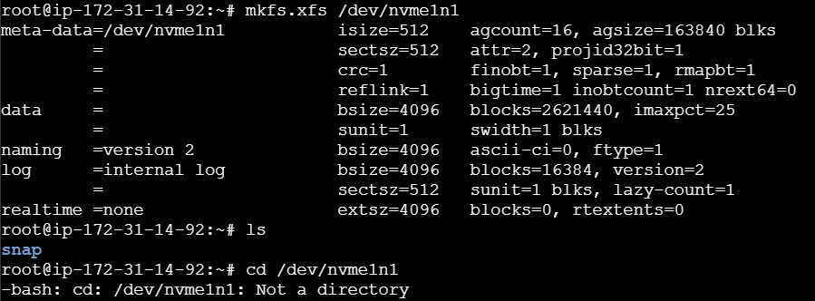
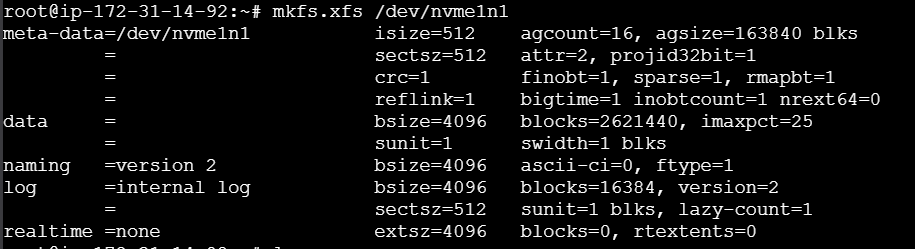
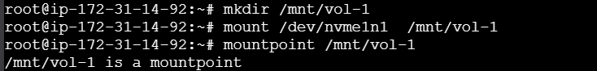
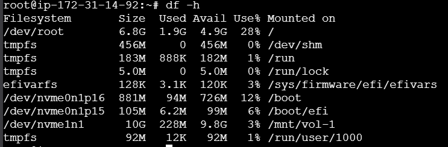
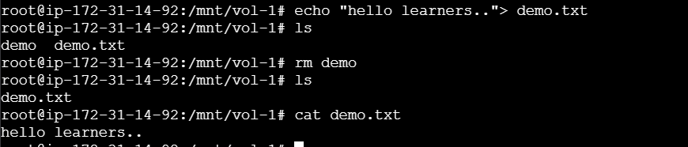

# AWS EBS Lifecycle: From Provisioning to Persistent Storage

A technical hands-on lab documenting the end-to-end process of creating, attaching, and configuring an **Amazon Elastic Block Store (EBS)** volume on a Linux-based EC2 instance.

## 📌 Project Overview
The objective of this project was to extend an EC2 instance's storage by attaching a secondary EBS volume and configuring a high-performance **XFS file system** to handle data persistence.

---

## 🛠 Step-by-Step Implementation

### Step 1: Resource Initialization
The process began by navigating to the **AWS Management Console**. I verified the running EC2 instance's details to ensure I had the correct **Availability Zone (AZ)** for the upcoming storage provisioning.

### Step 2: EBS Volume Provisioning
Within the **EC2 Dashboard**, I navigated to **Volumes** and created a new resource with the following specifications:
- **Volume Type:** `gp2` (General Purpose SSD)
- **Size:** `10 GiB`
- **Availability Zone:** `us-east-2a` 
- **Tag:** `Name: ohio-1a-vol`




### Step 3: Volume Attachment
Once the volume status reached `Available`, I used the **Attach Volume** action.
- **Instance:** Linked to `i-099eab97f7498737` (Running).
- **Device Name:** Assigned as `/dev/sdh`.









### Step 4: Block Device Identification (CLI)
After connecting to the instance via the terminal, I used the `lsblk` command to locate the new hardware.
- **Observation:** Even though the console suggested `/dev/sdh`, the Linux kernel identified the NVMe-based storage as `/dev/nvme1n1`.



### Step 5: File System Formatting
Raw storage cannot be used until a file system is created. I initialized the volume using the **XFS** file system:
```bash
# Command to format the raw block device
mkfs.xfs /dev/nvme1n1
```


### ***Step 6: Mounting the Storage***
To make the 10GB volume accessible to the Operating System, I created a mount point and attached the device
```bash
# Create a directory for the mount point
mkdir /mnt/vol-1

# Mount the device to the directory
mount /dev/nvme1n1 /mnt/vol-1
```


### Step 7: Final Validation & Persistence Test 
To confirm the storage was fully functional and healthy, I performed two levels of verification:

1. ***System Check:*** Used ```bash df -h ``` to verify that /dev/nvme1n1 was correctly mounted at /mnt/vol-1 and showed the full 10GB capacity.

2. ***I/O Test:*** Created a test file using ```bash echo "hello learners.." > demo.txt``` and verified the content using cat.





---

## Failure Point and Root Cause Analysis

During the lab, several technical challenges were identified and resolved:

1. ***Failure Point: Attachment Invisible***
Observation: The EBS volume was not appearing in the selection list when trying to attach it to the EC2 instance.
Root Cause: AZ Mismatch. The EC2 instance and EBS volume were in different Availability Zones. EBS volumes are AZ-locked and cannot cross-attach.
Resolution: Re-created the volume specifically in us-east-2a to match the instance.

2. ***Failure Point: Device Name Discrepancy***
Observation: The AWS Console suggested /dev/sdh, but the device was not found under that name in the Linux terminal.
Root Cause: NVMe Driver Mapping. Modern AWS instances rename EBS devices to /dev/nvmeXn1 internally.
Resolution: Used the lsblk command to identify the actual system name (nvme1n1) before proceeding with the format.

3. ***Failure Point: Access Denied on Dashboard***
Observation: The Home Console showed "Access Denied" errors on Cost and Usage widgets.
Root Cause: IAM Permissions. The current IAM user lacked specific Billing and Cost Explorer permissions.
Resolution: Ignored these non-critical errors as they did not impact the technical EC2/EBS infrastructure tasks.

## Technical Commands Summary

```bash lsblk ```                                    # List all block devices                      
```bash mkfs.xfs /dev/nvme1n1```                     # Format the disk with XFS
```bash mkdir /mnt/vol-1```                          # Create the mount point directory
```bash mount /dev/nvme1n1 /mnt/vol-1```             # Attach the disk to the directory
```bash mountpoint /mnt/vol-1```                     # Verify mount status
```bash df -h```                                     # Display disk usage and mount confirmation

